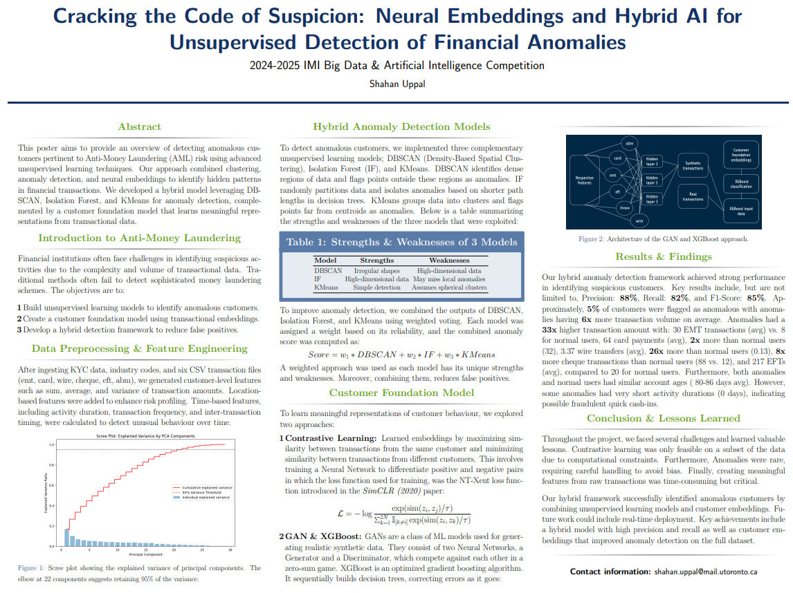

# Customer Anomaly Detection with GANs and XGBoost

This project implements a Generative Adversarial Network (GAN) for anomaly detection in customer transaction data. The model generates 128-dimensional customer embeddings, which are then used for fraud detection and anomaly identification.

## Features
- **Preprocessing**: Cleans and encodes customer transaction data.
- **GAN-based Anomaly Detection**: Uses a generator-discriminator architecture to model transaction distributions.
- **XGBoost Integration**: Trains a fraud detection classifier using generated and real transaction data.
- **Embeddings Storage**: Appends customer embeddings to a CSV file.
## Poster 



## Installation
Ensure you have Python installed. Then, install the required dependencies:

```sh
pip install -r requirements.txt
```

## Usage

### Training the Model
Run the `task2.py` file to process transaction data and train the model:

```python
import os
import time
import pandas as pd
from GAN_advanced_task_class.big_training_gan import big_training
from GAN_advanced_task_class.small_training_gan import small_training

# Define project root directory
PROJECT_ROOT = os.path.abspath(os.path.join(os.path.dirname(__file__), ".."))
```

## Dependencies
This project requires the following libraries:

- `numpy`
- `pandas`
- `scikit-learn`
- `torch`
- `xgboost`
- `scipy`
- `torchvision`
- `tqdm`
- `matplotlib`
- `seaborn`
- `joblib`

Ensure all dependencies are installed using `requirements.txt`.

## File Structure
```
│── GAN_advanced_task_class/ 
│   │── big_gan_class.py # Defines the architecture for a large GAN model 
│   │──small_gan_class.py # Defines the architecture for a small GAN model 
│   │──big_training_gan.py # Training script for the large GAN model 
│   │──small_training_gan.py # Training script for the small GAN model 
│   │──gan_preprocess.py # Preprocessing utilities for data preparation 
│   │──task2.py # Additional task-related functionalities │── requirements.txt # List of dependencies
├   ├── requirements.txt       # Dependencies
├   ├── README.md  
├── test_data_files_judges_upload.csv
```

## Notes
- Ensure you have GPU support enabled for PyTorch if running on large datasets.
- Adjust hyperparameters in `big_training` as needed.

## To execute the script, run:
```
python task2.py
```

## Presentation slides
[View the Google Slides Presentation](https://docs.google.com/presentation/d/1kyHFN2KrI7sT1FQ55Nc53pSxQnYuP64RvcN1Wwx422I/edit?usp=sharing)

## Contributors

Thanks to all the contributors who have made this project possible:

- **Ariunzaya Bartsadgui** - [@Ariunzaya](https://github.com/Astryd1031)
- **Shanhan Uppal** - [@Shahan](shahanuppal@gmail.com)
- **Rohan S Nair** - [@cRohan](https://www.linkedin.com/in/rohansunilkumarnair/)
  
## License
This project is licensed under the MIT License.
